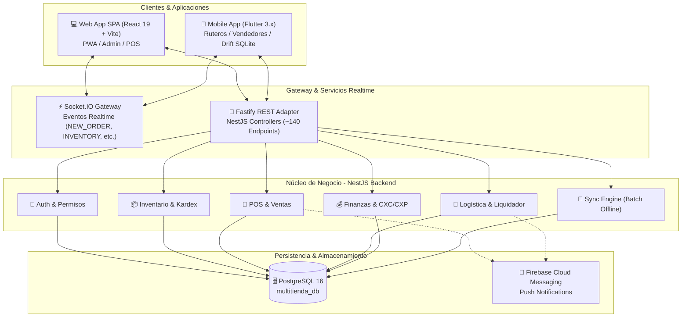
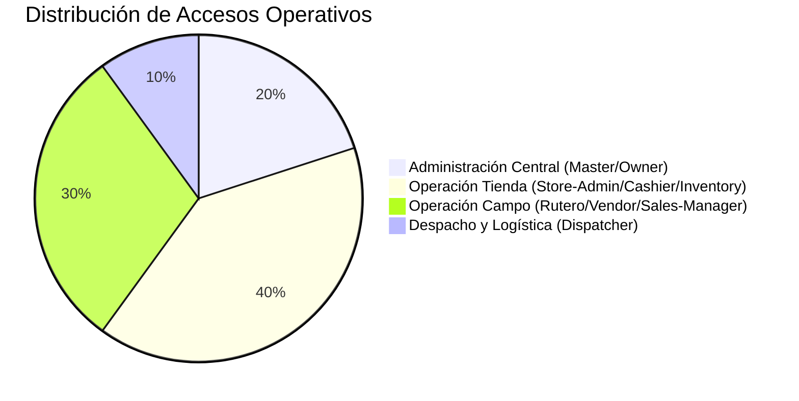
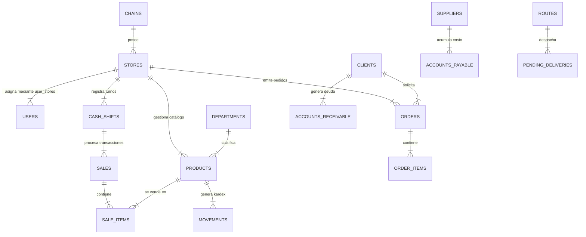
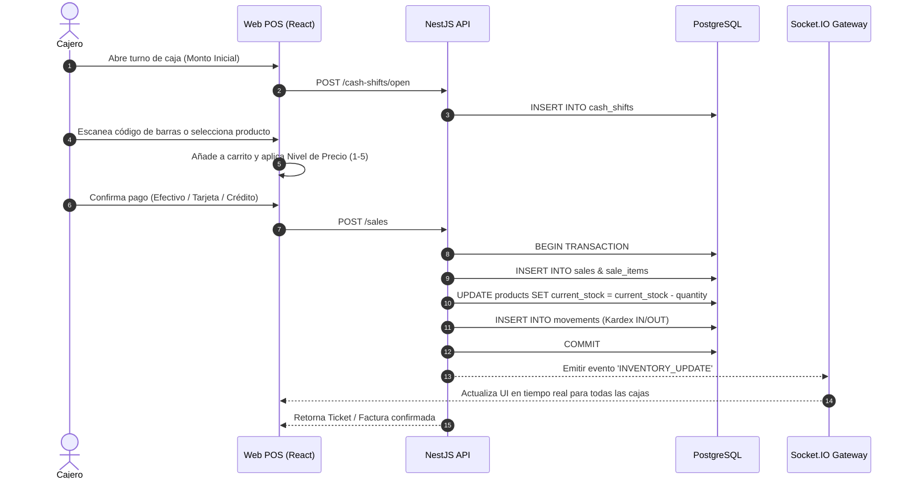
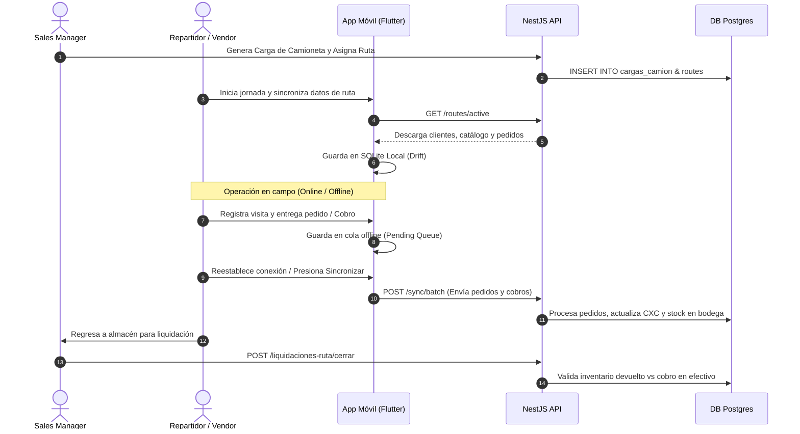

# 📐 BLUEPRINT SISTEMA MULTITIENDA "PINO2"
**Versión:** 2.0.0 (Corte de Auditoría & Arquitectura Activa)  
**Dominio:** Sistema de Gestión Multi-tienda, POS, Inventario Kardex, Logística de Rutas, Cobranza y Facturación.

---

## 1. RESUMEN EJECUTIVO Y PROPÓSITO DEL SISTEMA

**Pino2** es una plataforma empresarial omnicanal de alta eficiencia diseñada para cadenas comerciales, distribuidoras y tiendas de venta al por mayor/menor. El sistema integra operaciones de venta en mostrador (POS), administración centralizada multi-cadena, gestión de rutas de distribución en campo con conectividad intermitente, control de inventario en bultos y unidades, y reconciliación financiera en tiempo real.

> [!NOTE]
> La arquitectura del sistema está optimizada para baja latencia mediante consultas SQL directas en el backend (NestJS + Fastify + Pool `pg`), estado reactivo en web (React 19 + TanStack Query + Socket.IO) y persistencia offline-first en dispositivos móviles de campo (Flutter + Drift SQLite).

---

## 2. ARQUITECTURA GENERAL DEL SISTEMA



### 2.1 Especificaciones del Stack Tecnológico

| Capa | Tecnología | Características Clave | Ubicación en Código |
|---|---|---|---|
| **Backend** | NestJS 11 + Fastify | Ejecución ultrarrápida, validación DTO, Swagger | [backend/src](file:///c:/Users/carlo/OneDrive/Documents/Distri/pino2/backend/src) |
| **Persistencia Backend** | PostgreSQL 16 + Pool `pg` | Consultas SQL puras optimizadas sin ORM overhead | [backend/src/database](file:///c:/Users/carlo/OneDrive/Documents/Distri/pino2/backend/src/database) |
| **Web Frontend** | React 19 + Vite + TailwindCSS | TanStack Query v5, Radix UI, PWA responsive | [web/src](file:///c:/Users/carlo/OneDrive/Documents/Distri/pino2/web/src) |
| **App Móvil** | Flutter 3.x + Riverpod | Offline sync engine, Drift SQLite local, Dio HTTP | [flutterv2/lib](file:///c:/Users/carlo/OneDrive/Documents/Distri/pino2/flutterv2/lib) |
| **Comunicación Realtime** | Socket.IO Client/Server | Emisión bidireccional de inventario y pedidos | [backend/src/common/gateways](file:///c:/Users/carlo/OneDrive/Documents/Distri/pino2/backend/src/common/gateways) |

---

## 3. MATRIZ DE ROLES Y CONTROL DE ACCESO (RBAC)

El sistema soporta 9 roles diferenciados con redirecciones automáticas y permisos granulados sobre las API:



| Rol | Alcance | Descripción | Portal Principal |
|---|---|---|---|
| `master-admin` | Global | Control total multi-cadena, licencias, auditoría SQL y configuración global | `/master-admin` |
| `owner` | Cadena | Propietario de la cadena comercial, métricas consolidadas de tiendas | `/master-admin/stores` |
| `store-admin` | Tienda | Administrador sucursal: productos, precios, cierres, compras y usuarios | `/store-admin` |
| `cashier` | Punto de Venta | Operador POS, apertura/cierre de turnos de caja, cobranza rápida | `/pos` |
| `inventory` | Bodega | Ajustes de stock, recepción de órdenes de compra, transferencias | `/store-admin/inventory` |
| `dispatcher` | Despacho | Torre de control de comandas, empaque y preparación de cargas | `/store-admin/dispatch` |
| `rutero` | Campo/Ruta | Repartidor en ruta, entrega de pedidos, cobros contra entrega | App Móvil / `/work` |
| `vendor` | Campo/Ventas | Vendedor ambulante/prevendedor, toma de pedidos, catálogo en vivo | App Móvil / `/work` |
| `sales-manager` | Supervisión | Gestor de rutas, asignación de zonas, liquidación de camionetas | `/store-admin/routes` |

---

## 4. MODELO DE BASE DE DATOS Y ENTIDADES (36 TABLAS)

El esquema de PostgreSQL se articula en torno a 36 tablas interrelacionadas con identificadores UUID y trazabilidad completa de auditoría.



### 4.1 Resumen Estructural de Tablas por Dominio

#### 🔐 Seguridad y Estructura Organizativa
- **`chains`**: Cadenas de tiendas (`id`, `name`, `logo_url`, `owner_name`, `status`).
- **`stores`**: Sucursales físicas (`id`, `chain_id`, `name`, `settings` JSONB con flags de modo operativo).
- **`users`**: Usuarios y credenciales (`id`, `email`, `password_hash`, `role`, `refresh_token`).
- **`user_stores`**: Tabla pivot N:M que define las tiendas permitidas por usuario (`user_id`, `store_id`).

#### 📦 Catálogo de Productos e Inventario Kardex
- **`departments`**: Categorías de productos (`id`, `store_id`, `name`).
- **`products`**: Productos con multiniiveles de precio y control bulto/unidad:
  - Campos clave: `id`, `store_id`, `barcode`, `description`, `sale_price`, `cost_price`, `current_stock`.
  - **Estructura Bultos**: `units_per_bulk`, `stock_bulks`, `stock_units`.
  - **Niveles de Precio (1 al 5)**: `price1`, `price2`, `price3`, `price4`, `price5`.
- **`movements`**: Kardex detallado de inventario (`id`, `product_id`, `store_id`, `type` [IN/OUT/ADJUST], `quantity`, `reference_type`, `created_at`).
- **`product_barcodes`**: Códigos alternativos y múltiples códigos EAN/UPC por producto.

#### 🛒 Punto de Venta (POS) y Turnos de Caja
- **`cash_shifts`**: Turnos de caja (`id`, `store_id`, `user_id`, `start_amount`, `end_amount`, `status` [OPEN/CLOSED], `opened_at`, `closed_at`).
- **`sales`**: Cabecera de venta (`id`, `store_id`, `cash_shift_id`, `client_id`, `total_amount`, `payment_type`, `status`).
- **`sale_items`**: Detalle de ítems vendidos (`id`, `sale_id`, `product_id`, `quantity`, `unit_price`, `total_price`, `is_bulk`).

#### 🚚 Rutas, Pedidos y Despacho en Campo
- **`zones`** & **`sub_zones`**: Zonas geográficas y sub-sectores de entrega.
- **`routes`**: Definición de rutas comerciales/reparto (`id`, `store_id`, `driver_id`, `vehicle_id`, `status`).
- **`orders`** & **`order_items`**: Preventa y pedidos de clientes (`id`, `client_id`, `vendor_id`, `status` [PENDING/APPROVED/DELIVERED/CANCELLED]).
- **`pending_orders`**: Comandas de despacho para la pantalla de empacadores (`dispatcher`).
- **`pending_deliveries`**: Hoja de ruta para el repartidor (`rutero`).
- **`cargas_camion`** & **`liquidaciones_ruta`**: Cargas masivas a camionetas y cuadre final de mercancía vs cobros al regresar.
- **`visit_logs`**: Geolocalización y registro de visitas a clientes por vendedores en campo.

#### 💰 Finanzas, Cartera (CXC) y Cuentas por Pagar (CXP)
- **`accounts_receivable`**: Cuentas por cobrar a clientes (`id`, `client_id`, `sale_id`, `total_amount`, `balance`, `status`).
- **`account_payments`**: Recibos de abono a cuentas por cobrar.
- **`accounts_payable`** & **`payable_payments`**: Deudas con proveedores y registro de pagos realizados.
- **`collections`**: Módulo de liquidación de cobranza de campo por vendedor/rutero.
- **`daily_closings`**: Cierre consolidado diario de la tienda (`id`, `store_id`, `total_sales`, `cash_expected`, `cash_real`, `discrepancy`).

---

## 5. MÓDULOS DEL SISTEMA Y REPOSITORIO DE CÓDIGO

### 5.1 Backend REST API (NestJS + Fastify)
Ubicación: [`backend/src/modules`](file:///c:/Users/carlo/OneDrive/Documents/Distri/pino2/backend/src/modules)

```
backend/src/modules/
├── auth/                 # Autenticación JWT, Hashing bcrypt y guards
├── products/             # CRUD Productos, códigos de barra y 5 precios
├── inventory/            # Kardex de movimientos y ajuste de stock
├── sales/                # Procesamiento de ventas en POS
├── cash-shifts/          # Apertura, arqueo y cierre de turno de caja
├── orders/               # Levantamiento y aprobación de pedidos
├── pending-orders/       # Gestión de comanda para despacho
├── routes/               # Asignación y monitoreo de rutas
├── liquidaciones-ruta/   # Conciliación de camioneta y liquidación
├── accounts-receivable/  # Cartera CXC y abonos
├── accounts-payable/     # Cuentas por pagar a proveedores
├── daily-closings/       # Cierre diario financiero de tienda
├── sync/                 # Motor de sincronización batch offline
└── notifications/        # Emisión de alertas push vía Firebase
```

### 5.2 Frontend Web App (React 19 + Vite)
Ubicación: [`web/src/pages`](file:///c:/Users/carlo/OneDrive/Documents/Distri/pino2/web/src/pages)

```
web/src/pages/
├── pos-page.tsx                  # Punto de venta táctil e instantáneo
├── master-admin/                 # Administración global y licencias
│   ├── chains/                   # Cadenas comerciales
│   └── stores/                   # Sucursales y configuraciones
└── store-admin/                  # Administración de Sucursal
    ├── dashboard/                # Métricas e indicadores clave (KPIs)
    ├── products/                 # Gestión de catálogo y precios
    ├── inventory/                # Ajustes y transferencias de bodega
    ├── cash-register/            # Arqueo de caja y turnos
    ├── dispatch/                 # Pantalla para despachadores (Comandas)
    ├── routes/                   # Creación y seguimiento de rutas
    ├── finance/                  # CXC, CXP y Cierre diario
    └── reports/                  # Reportes ejecutivos y de auditoría
```

### 5.3 Mobile App (Flutter 3.x)
Ubicación: [`flutterv2/lib`](file:///c:/Users/carlo/OneDrive/Documents/Distri/pino2/flutterv2/lib)

- **`features/auth`**: Login y persistenica de sesión local.
- **`features/catalog`**: Catálogo local de productos con sincronización en segundo plano.
- **`features/clients`**: Directorio de clientes con mapa y saldo de cartera.
- **`features/orders`**: Captura offline de preventa y cálculo de precios por tipo de cliente.
- **`features/deliveries`**: Hoja de trabajo del repartidor para confirmación de entrega y firmas.
- **`features/collections`**: Recaudación en campo de abonados/pagos con registro en SQLite local (`Drift`).

---

## 6. FLUJOS OPERATIVOS CLAVE

### 6.1 Flujo de Venta en Punto de Venta (POS)



### 6.2 Flujo de Ruta: Carga, Preventa, Entrega y Liquidación



---

## 7. EVENTOS EN TIEMPO REAL Y MOTOR DE SINCRONIZACIÓN

### 7.1 WebSocket Events (`Socket.IO`)
El backend utiliza la clase [`EventsGateway`](file:///c:/Users/carlo/OneDrive/Documents/Distri/pino2/backend/src/common/gateways/events.gateway.ts) para la sincronización multi-pantalla en la tienda:

- `NEW_ORDER`: Notifica al despacho la entrada de un pedido de preventa.
- `NEW_VISIT`: Actualiza el mapa de la torre de control cuando un vendedor marca visita.
- `PRODUCT_CREATED` / `PRODUCT_UPDATED`: Refresca catálogo en las cajas.
- `INVENTORY_UPDATE`: Refresca el stock disponible para evitar sobreventas.

### 7.2 Motor Offline y Resiliencia
En caso de pérdida de conectividad a internet en la App Móvil o la Web PWA:
1. Las operaciones write (ventas, cobros, visitas) se encadenan en `indexedDB` (Web) o `Drift SQLite` (Mobile).
2. Se muestra un indicador de estado con el recuento de operaciones pendientes (`Pending Sync Count`).
3. Al restaurar la conexión HTTP/WebSocket, el cliente invoca automáticamente el endpoint `/sync/batch`, procesando las transacciones de forma atómica y resolviendo conflictos por marca de tiempo (`timestamp`).

---

## 8. GUÍA DE DESPLIEGUE Y OPERACIÓN DE INFRAESTRUCTURA

### 8.1 Scripts de Automatización en Servidor

El servidor de producción (VPS) cuenta con scripts de despliegue automatizado:

- **`./manual_update.sh`**: Wrapper principal recomendado para actualizar código y reiniciar servicios con PM2.
- **`./manual_update_dev.sh`**: Script configurable para compilaciones por capa:
  - `manual_update_dev.sh all`: Git pull + build backend + build web + reload PM2.
  - `manual_update_dev.sh backend`: Recompila únicamente la API REST.
  - `manual_update_dev.sh web`: Publica cambios del frontend en el directorio servido.

### 8.2 Comandos de Ejecución Local

```bash
# 1. Levantar el Backend
cd backend
npm install
npm run build
node dist/main.js # Escucha en http://localhost:3010

# 2. Levantar el Frontend Web
cd web
npm install
npm run dev # Escucha en http://localhost:5173

# 3. Levantar la App Móvil Flutter
cd flutterv2
flutter pub get
flutter run
```

---

## 9. VERIFICACIÓN Y ARCHIVOS REFERENCIADOS

- 📜 **Esquema de BD:** [`backend/src/database/schema.sql`](file:///c:/Users/carlo/OneDrive/Documents/Distri/pino2/backend/src/database/schema.sql)
- ⚙️ **Módulos Backend:** [`backend/src/app.module.ts`](file:///c:/Users/carlo/OneDrive/Documents/Distri/pino2/backend/src/app.module.ts)
- 🌐 **Rutas Web React:** [`web/src/App.tsx`](file:///c:/Users/carlo/OneDrive/Documents/Distri/pino2/web/src/App.tsx)
- 📱 **App Móvil Flutter:** [`flutterv2/lib/main.dart`](file:///c:/Users/carlo/OneDrive/Documents/Distri/pino2/flutterv2/lib/main.dart)
- 📄 **Documentación Técnica Adicional:** [`docs/00_INDEX.md`](file:///c:/Users/carlo/OneDrive/Documents/Distri/pino2/docs/00_INDEX.md)
