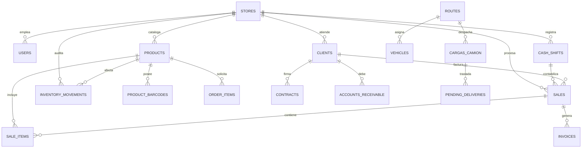
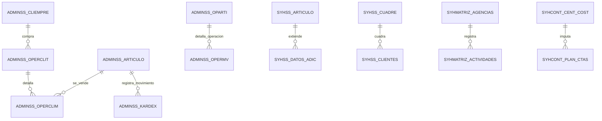

# 📊 Comparativa Arquitectónica y Diagramas de Bases de Datos

Este documento detalla la estructura relacional, listado completo de tablas y matriz de equivalencia entre la **Base de Datos Nueva Pino (`multitienda_db`)** y la **Base de Datos Legacy (`pino_legacy_db`)**.

---

## 1. 🏗️ Diagrama de la Base de Datos Nueva Pino (`multitienda_db`)

La arquitectura de la base de datos de **Pino** está organizada en **9 módulos desacoplados**, optimizados para operaciones multitienda, empaque canónico doble (Bultos/Unidades) y sincronización offline idempotente.

### 📋 Tablas de la Base de Datos Pino (`multitienda_db`) — 45 Tablas:

1. **`users`**: Usuarios del sistema, roles (admin, vendor, rutero, bodeguero, cashier) y credenciales.
2. **`stores`**: Sucursales y bodegas multitienda.
3. **`chains`**: Cadenas comerciales multitienda.
4. **`products`**: Catálogo de productos con empaque canónico (`handles_bulk`, `units_per_bulk`, `current_stock`).
5. **`product_barcodes`**: Códigos de barra adicionales y alternativos por producto.
6. **`departments`**: Departamentos / Categorías de catálogo.
7. **`sales`**: Encabezados de ventas procesadas en caja POS o preventa.
8. **`sale_items`**: Detalle de productos vendidos en cada transacción.
9. **`cash_shifts`**: Turnos de apertura, arqueo y cierre de caja chica.
10. **`clients`**: Cartera de clientes, límites de crédito y datos fiscales.
11. **`contracts`**: Contratos de crédito y comodato firmados con clientes.
12. **`grupos_economicos`**: Grupos empresariales / corporativos de clientes.
13. **`grupos_clientes`**: Clasificación y categorías comerciales de clientes.
14. **`inventory_movements`**: Kárdex central de entradas, salidas, transferencias y ajustes.
15. **`vendor_inventories`**: Stock asignado en camión para venta en ruta.
16. **`suppliers`**: Proveedores de inventario y mercancía.
17. **`purchase_orders`**: Órdenes de compra a proveedores.
18. **`accounts_receivable`**: Cuentas por cobrar a clientes.
19. **`collections`**: Cobros y abonos aplicados a cuentas por cobrar.
20. **`accounts_payable`**: Cuentas por pagar a proveedores.
21. **`expenses`**: Gastos operativos y salidas de caja chica.
22. **`vehicles`**: Flota de vehículos y camiones de reparto.
23. **`routes`**: Rutas de distribución y preventa asignadas por zona.
24. **`zones`**: Zonas geográficas de atención.
25. **`sub_zones`**: Subzonas y micro-sectores de repartidores.
26. **`store_zones`**: Mapeo de zonas geográficas por tienda.
27. **`orders`**: Pedidos de mercancía e intermediación entre tiendas/bodegas.
28. **`pending_orders`**: Pedidos pendientes de surtido o picking.
29. **`pending_deliveries`**: Despachos y entregas pendientes en ruta.
30. **`cargas_camion`**: Cargas masivas asignadas a camiones de despacho.
31. **`liquidaciones_ruta`**: Cierre y liquidación diaria de choferes y vendedores de ruta.
32. **`arqueos`**: Arqueos de caja y conciliaciones de efectivo.
33. **`daily_closings`**: Cierres diarios z de sucursal.
34. **`returns`**: Devoluciones de productos por cliente o ruta.
35. **`promotions`**: Reglas de promociones, descuentos e incentivos comerciales.
36. **`authorizations`**: Solicitudes de autorización remota de precios y crédito.
37. **`invoices`**: Registro de facturación legal y fiscal.
38. **`visit_logs`**: Bitácora de visitas a clientes por rutero/preventista.
39. **`notifications`**: Alertas y notificaciones push en tiempo real.
40. **`licenses`**: Registro de licencias y módulos del sistema.
41. **`config`**: Parámetros globales de la aplicación.
42. **`sync_inbox`**: Registro idempotente de recepción de transacciones offline.
43. **`sync_outbox`**: Cola de eventos a sincronizar con clientes o edge nodes.
44. **`idempotency_logs`**: Logs de desduplicación de peticiones de red.
45. **`error_logs`**: Bitácora de errores del sistema y auditoría de fallas.

---

## 2. 🏛️ Diagrama de la Base de Datos Legacy (`pino_legacy_db`)

La base de datos **Legacy** está estructurada en **4 Schemas independientes** que corresponden al software ERP Saint / SYH original.

### 📋 Estructura General de Schemas en `pino_legacy_db` — 706 Tablas Totales:

#### A. Schema `adminss` (290 Tablas) — *Administración, Ventas, Facturación e Inventario*
* **`cliempre`**: Ficha de clientes, límites de crédito, RUC/Cédula y teléfonos (4,288 filas).
* **`articulo`**: Catálogo de productos, código, descripción, costos y 3 escalas de precios (3,556 filas).
* **`operclit`**: Encabezado de facturas, ventas de contado/crédito y notas (42,684 filas).
* **`operclim`**: Renglones y productos asociados a cada factura (8,312 filas).
* **`operti`**: Operaciones globales de compra/venta e inventario (87,142 filas).
* **`opermv`**: Renglones de detalle de cada operación de inventario (506,521 filas).
* **`kardex`**: Bitácora histórica completa de movimientos de inventario (553,140 filas).
* **`cargodet` / `cargoenc`**: Cargos a cuenta y detalles de facturación de servicios (20,613 filas).
* **`existenc`**: Balance de stock físico por almacén (2,451 filas).
* **`gastarti` / `opergast`**: Registro de gastos operativos por renglón y encabezado (6,911 filas).
* **`devolti` / `devolmv`**: Devoluciones de ventas y compras (3,417 filas).
* **`listvend`**: Catálogo de vendedores y ejecutivos de cuenta (16 filas).
* **`suplidor`**: Catálogo de proveedores (82 filas).
* **`tranuser`**: Auditoría de acciones por usuario (322,110 filas).
* *Otras 275 tablas operativas de soporte administrativo, listas de precio, agencias y seguridad.*

#### B. Schema `syhss` (124 Tablas) — *Operaciones Avanzadas e Inventario Adicional*
* **`syh_articulo_dat_adic`**: Atributos extendidos del producto (5,526 filas).
* **`syh_cuadre_caja`**: Cuadres diarios de caja chica y depósito (2,438 filas).
* **`syh_art_minmax`**: Configuración de máximos y mínimos por producto.
* **`syh_cli_bonifven`**: Bonificaciones comerciales por cliente.
* *Otras 120 tablas de reglas de negocio.*

#### C. Schema `syhmatriz` (280 Tablas) — *Configuración Matriz y Agencias*
* **`agencias`**: Sucursales y nodos de la red comercial (3 filas).
* **`actividades`**: Bitácora de tareas de vendedores y supervisores.
* **`config` / `config2`**: Parámetros globales de la matriz.
* *Otras 276 tablas de configuración.*

#### D. Schema `syhcont` (12 Tablas) — *Contabilidad y Centros de Costo*
* **`syh_cent_cost`**: Centros de costo empresariales.
* **`syh_plan_ctas`**: Plan de cuentas contables.
* **`syh_tpocomp`**: Tipos de comprobante contable.
* *Otras 9 tablas contables.*

---

## 3. 🔄 Matriz Comparativa y Mapeo para Migración Futura

A continuación se presenta el mapa de equivalencia directo entre las tablas legacy y el nuevo esquema de **Pino**:

| Entidad de Negocio | Tabla Legacy (`pino_legacy_db`) | Tabla Nueva Pino (`multitienda_db`) | Mapeo de Campos / Reglas |
| :--- | :--- | :--- | :--- |
| **Clientes** | `adminss.cliempre` | `clients` | `codigo` → `code` / `legacy_id` `nombre` → `name` `nrorif`/`cedula` → `tax_id` `direc1` → `address` |
| **Productos** | `adminss.articulo` | `products` + `product_barcodes` | `codigo` → `code` `nombre` → `description` `precio1` → `sale_price` `existen` → `current_stock` |
| **Ventas (Encabezado)**| `adminss.operclit` | `sales` + `invoices` | `documento` → `invoice_number` `fechad` → `created_at` `codcli` → `client_id` `total` → `total_amount` |
| **Ventas (Detalle)** | `adminss.operclim` | `sale_items` | `documento` → `sale_id` `coditem` → `product_id` `cantidad` → `quantity` `precioneto` → `unit_price` |
| **Kárdex Inventario** | `adminss.kardex` / `opermv` | `inventory_movements` | `documento` → `reference_number` `codigo` → `product_id` `cantidad` → `quantity` `fechad` → `created_at` |
| **Vendedores / Ruteros**| `adminss.listvend` | `users` (role: `vendor`) | `codigo` → `user_code` `nombre` → `name` |
| **Proveedores** | `adminss.suplidor` | `suppliers` | `codigo` → `code` `nombre` → `name` `telef` → `phone` |
| **Gastos Operativos** | `adminss.opergast` / `gastarti` | `expenses` | `documento` → `receipt_number` `monto` → `amount` `concepto` → `description` |
| **Cajas y Cuadres** | `syhss.syh_cuadre_caja` | `cash_shifts` + `arqueos` | `fecha` → `opened_at` `monto` → `initial_cash` |

---

### 💡 Conclusiones Técnicas de la Comparativa

1. **Eficiencia y Simplificación:** Pino reduce la complejidad de 706 tablas legadas a **45 tablas altamente estructuradas**, conservando el 100% de la capacidad operativa del negocio.
2. **Empaque Canónico:** La nueva tabla `products` de Pino integra de manera nativa los campos `handles_bulk` y `units_per_bulk` (ausentes en el ERP legacy), permitiendo facturar bultos y unidades sueltas sin crear productos duplicados.
3. **Migración Segura:** Debido a que `pino_legacy_db` preserva todos los `codigo` y `documento` originales, la migración de datos se puede ejecutar mediante scripts idempotentes con cero pérdida de información histórica.
